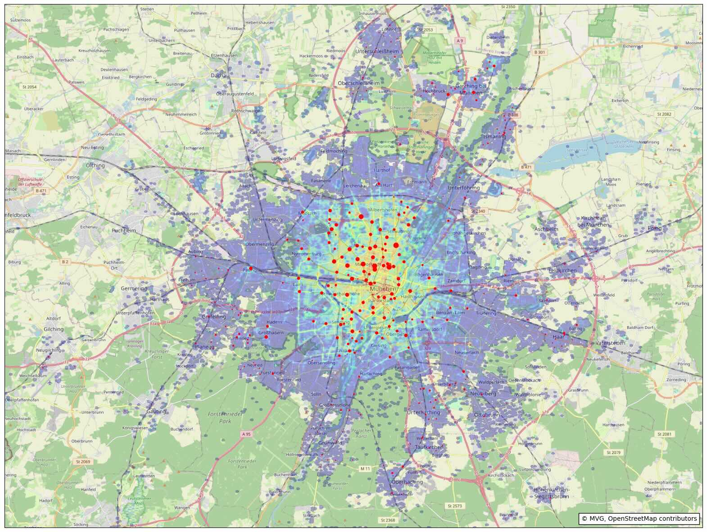

# Exploring MVG Rad data

[MVG Rad](https://www.mvg.de/ueber-die-mvg/unsere-fahrzeuge/mvg-rad.html) is the bike sharing service of Munich (2015-2025).

They make the raw data of their rides available for download.
Let's explore these data.

## Viewing

If you are viewing this on GitHub, you can just open the [Jupyter Notebook mvg-rad.ipynb](mvg-rad.ipynb) to see my statistics and maps.
  
## Development summary

If you want to check out the code and do your own analysis, here a few hints:

* This project uses uv to manage dependencies.
  See [uv installation instructions](https://docs.astral.sh/uv/getting-started/installation/).
* Use `uv sync` to install the dependencies.
* Download the raw data from the [MVG Rad download page](https://www.mvg.de/ueber-die-mvg/unsere-fahrzeuge/mvg-rad/mvg-rad-rohdaten.html).
  Unpack them end put them in the folder [raw-data](raw-data/Readme.md).
* The latest file, `MVG_Rad_Fahrten_2024.csv` is encoded in iso-8859-1, not UTF-8 like the other files.
  You need to convert it to UTF-8 manually.
* Launch the Jupyter Notebook [mvg-rad.ipynb](mvg-rad.ipynb).

## Acknowledgements

* Map data © [OpenStreetMap](https://www.openstreetmap.org/copyright) contributors
